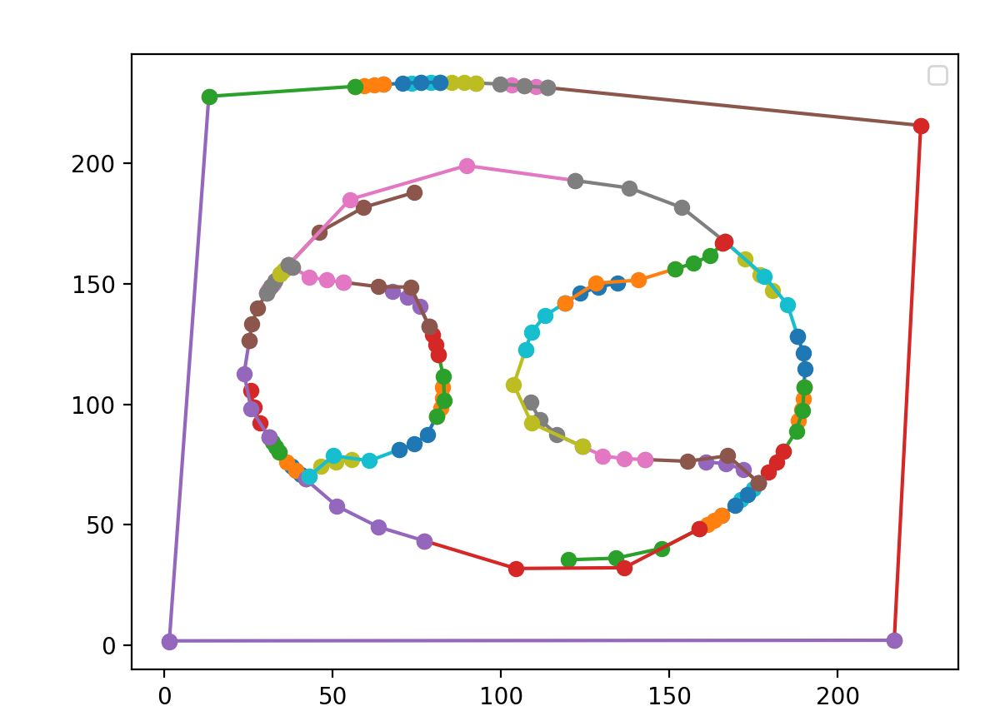
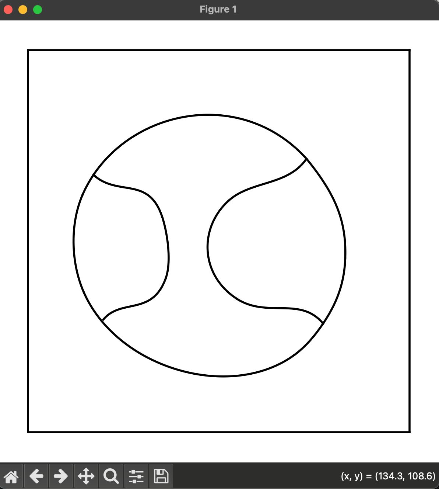
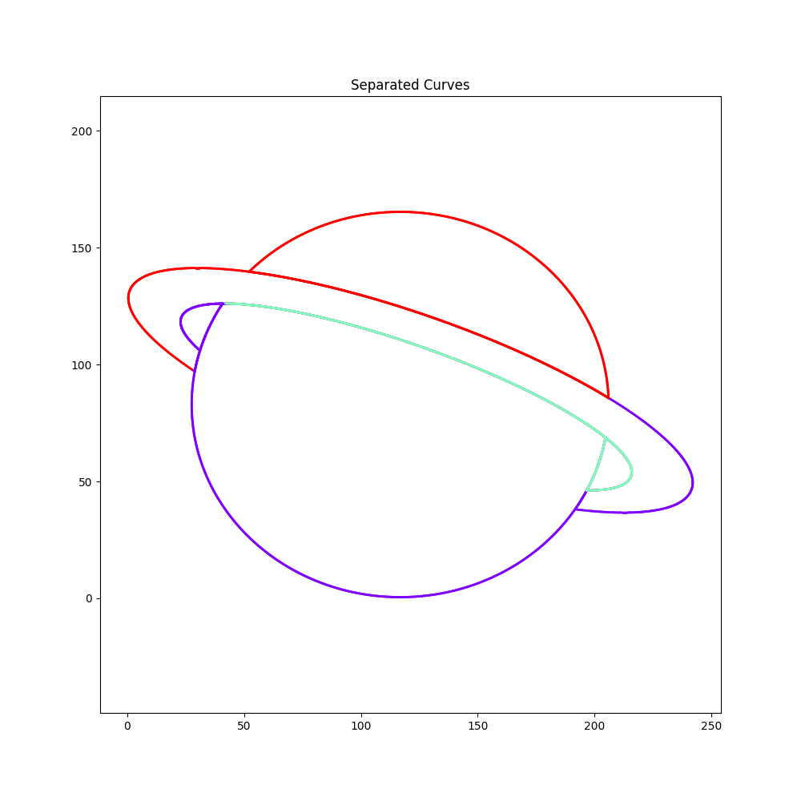
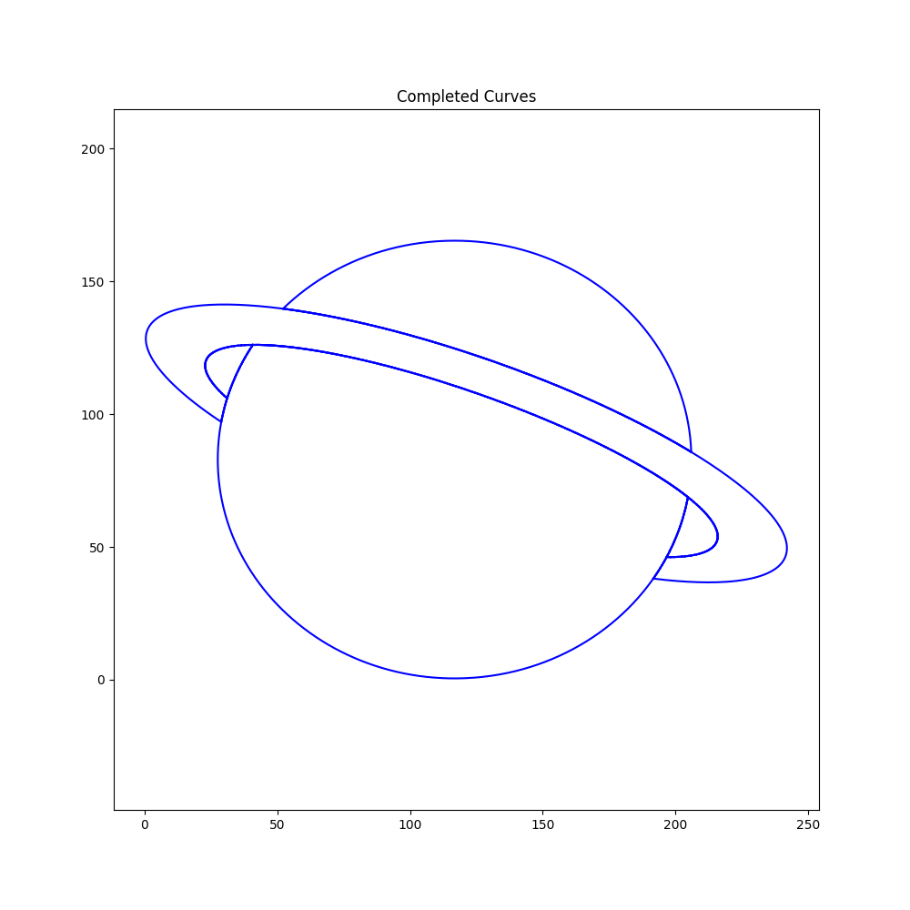
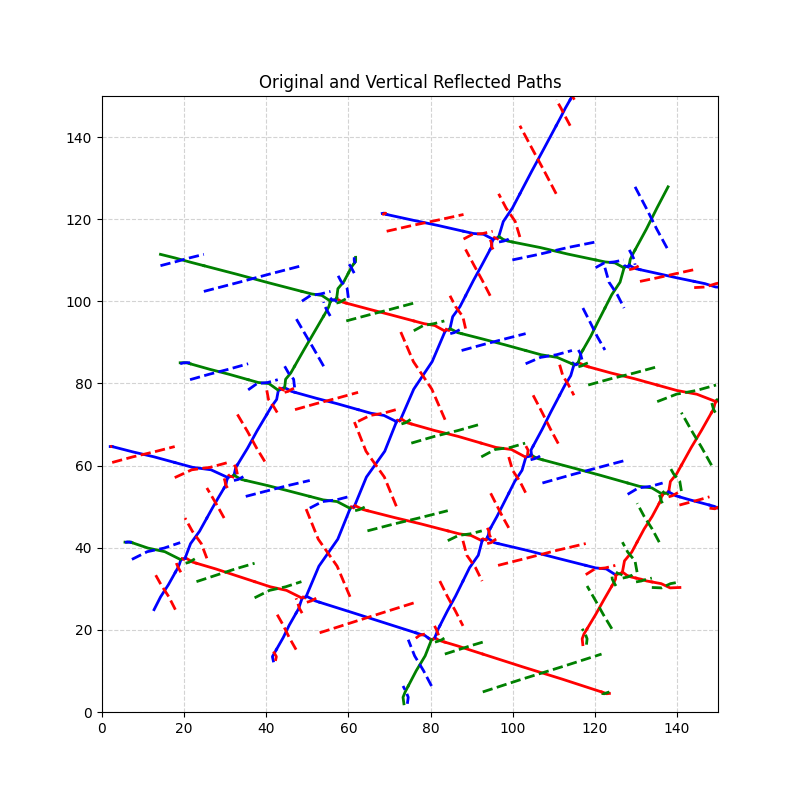
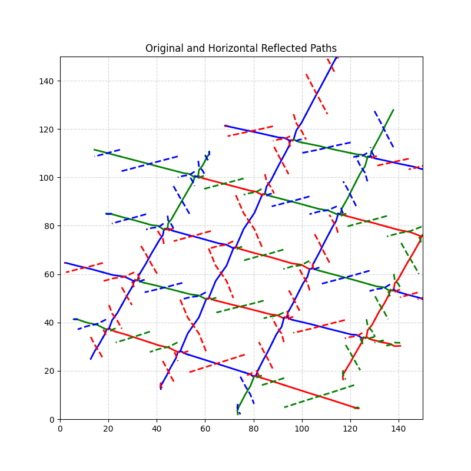
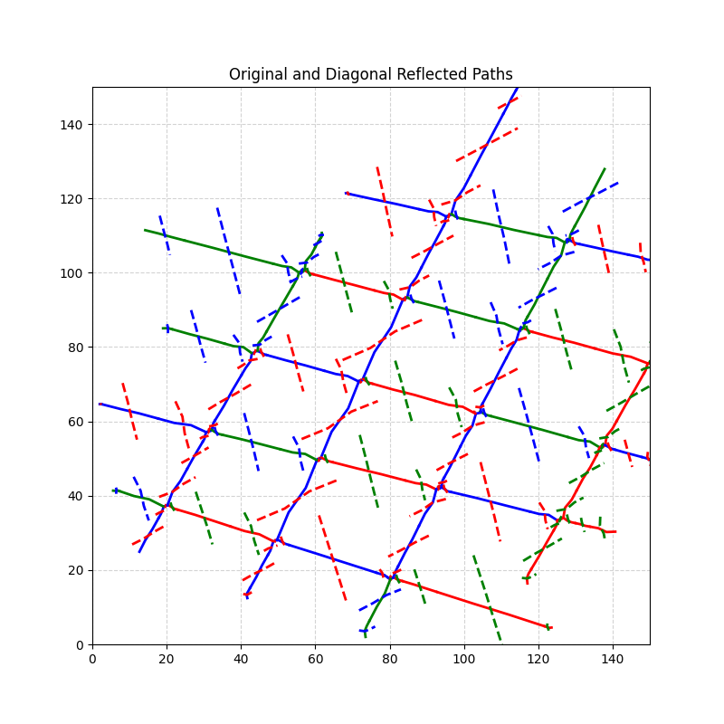

# Curvetopia- Adobe GenSolve Hackathon

Curvetopia is a project focused on transforming 2D line art into smooth, regularized curves. Starting with polylines, we convert them into connected sequences of cubic Bézier curves. The goal is to achieve symmetry, completeness, and visual harmony, with outputs in SVG format for easy rendering and visualization


## Background
Curvetopia originated to refine 2D line art, focusing on converting irregular polylines into smooth, aesthetically pleasing curves.
## Installation

To install this project on your local IDE.

### 1. Install Virtual Environment
```bash 
  python -m venv venv
```
### 2. Activate the Virtual Environment
#### For Windows
```bash 
  venv\Scripts\activate
```
### For MacOS/Linux
```bash 
  source venv/bin/activate
```
### 3. Run Requirements file 
```bash 
  pip install -r requirements.txt
```
### 4. Generate Synthetic DataSet and Predict Classes
```bash 
  pip install -r requirements.txt
  python {data_preparation}.py  // add relative path
  python {train}.py  // add relative path
```
### 5. To Regularize Curves
```bash 
  python regularize.py     // Add the relative path to image which is to be regularized. 
```
### 6. To Complete Curves
```bash 
  python complete_curves.py     // Add the relative path to image which is to be completed.
```
### 6. To Obtain Symmetry
```bash 
  python symmetry_detection.py     // Add the relative path to image.
```


## Approach

### Data Prediction
#### Class Prediction

- **Data Preparation**: 
  - Load new data for prediction from the specified directory.
  - Ensure the data is correctly loaded; otherwise, raise an error if the data is empty.

- **Data Normalization**:
  - Normalize the input data by scaling pixel values to the range [0, 1].

- **Model Loading**:
  - Load the pre-trained model from the provided model file (e.g., `model.h5`).

- **Prediction Process**:
  - Use the loaded model to predict class probabilities for the new data.
  - Convert the predicted one-hot encoded vectors into class labels by identifying the index of the highest probability.

- **Output**:
  - Print the predicted class labels for the input data.


### 1.  Segment Regularization

The first approach focuses on extracting and regularizing path segments, such as lines and cubic Bézier curves, from an SVG file. Here's how it works:

•⁠ ⁠**Segment Extraction**: The algorithm reads the SVG file and extracts all path segments, isolating those that are either straight lines or cubic Bézier curves. 

• ⁠**Geometric Regularization**: Once the segments are identified, the algorithm analyzes them to detect any irregularities. For instance, if the shape approximates a square, the algorithm adjusts the vertices and segment lengths to create a perfectly regular square.

•⁠ **Precision and Symmetry**: This process ensures that all shapes, regardless of their complexity, are regularized to achieve geometric consistency. This is essential for applications that require high precision, such as vector graphic design or CAD modeling.

**Example Use Case**: Perfecting the edges of a nearly square shape, ensuring that all sides are equal and all angles are right angles.

**Initial Iteration**: 
We tried to match the coordinates of two adjacent points and increased the stroke width to achieve better results but they were not satisfactory. 


**Landmarks on input**:
Here we tried gathering points on the curve where it showed slight distortion, this was to see where the smoothening algorithm should work. 





**Final Output**: 
Here we were able to achieve the perfect square and smoothened curves. The algorithm identifies the number of curves and contents and works accordingly. 





### 2. Curve Completion

The second approach is designed to handle the **completion of curves**, ensuring that all open paths are seamlessly closed. This technique uses advanced spatial analysis to achieve this:

- **Endpoint Detection**: The algorithm converts the SVG paths into `LineString` objects and identifies all endpoints.

- **Efficient Connection**: Using a `cKDTree` for fast nearest-neighbor searches, the algorithm connects these endpoints if they are within a specified distance, forming closed shapes where appropriate.

- **Final Adjustments**: The final step involves merging all lines and making sure that any nearly closed curves are perfectly sealed, ensuring the integrity of the shapes.

**Example Use Case**: Automatically closing open curves in a complex design, such as a partially drawn circle, to ensure it forms a perfect loop.


**Separated Curves**
We first tested to figure out the different curves so as to begin working on them. 




**Final Output**




### 3. Symmetry Detection

This involves processing and manipulating SVG paths to detect and apply symmetry operations. The key functionalities include reflecting paths across vertical, horizontal, and diagonal lines and visualizing the results.

1.⁠ **SVG Path Extraction**: 
   - Reads SVG files and extracts paths as sets of points.

2.⁠ ⁠**Symmetry Detection and Reflection**: 
   - Supports reflection of paths across vertical, horizontal, and diagonal lines.
   - Applies mathematical operations to calculate reflected points.

3.⁠ ⁠**Visualization**:
   - Original and reflected paths are plotted with distinct colors.
   - The results are saved as images for easy comparison.

##### **Usage**

1.⁠ ⁠**Vertical Symmetry**:
   - Reflects paths across a vertical line passing through the midpoint of each segment.




2.⁠ ⁠**Horizontal Symmetry**:
   - Reflects paths across a horizontal line passing through the midpoint of each segment.




3.⁠ ⁠**Diagonal Symmetry**:
   - Reflects paths across a 45-degree diagonal line.




