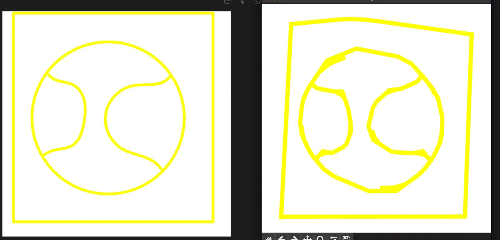

# Curvetopia- Adobe GenSolve Hackathon

Curvetopia is a project focused on transforming 2D line art into smooth, regularized curves. Starting with polylines, we convert them into connected sequences of cubic Bézier curves. The goal is to achieve symmetry, completeness, and visual harmony, with outputs in SVG format for easy rendering and visualization


## Background
Curvetopia originated to refine 2D line art, focusing on converting irregular polylines into smooth, aesthetically pleasing curves.
## Installation

To install this project on your local IDE.

### 1. Install Virtual Environment
```bash 
  python -m venv venv
```
### 2. Activate the Virtual Environment
#### For Windows
```bash 
  venv\Scripts\activate
```
### For MacOS/Linux
```bash 
  source venv/bin/activate
```
### 3. Run Requirements file 
```bash 
  pip install -r requirements.txt
```
### 4. Generate Synthetic DataSet and Predict Classes
```bash 
  pip install -r requirements.txt
  python {data_preparation}.py  // add relative path
  python {train}.py  // add relative path
```
### 5. To Regularize Curves
```bash 
  python regularize.py     // Add the relative path to image which is to be regularized. 
```
### 6. To Complete Curves
```bash 
  python complete_curves.py     // Add the relative path to image which is to be completed. 
```
## Approach
### Data Prediction

### Approach 1: Segment Regularization

The first approach focuses on extracting and regularizing path segments, such as lines and cubic Bézier curves, from an SVG file. Here's how it works:

•⁠ ⁠**Segment Extraction**: The algorithm reads the SVG file and extracts all path segments, isolating those that are either straight lines or cubic Bézier curves. 

• ⁠**Geometric Regularization**: Once the segments are identified, the algorithm analyzes them to detect any irregularities. For instance, if the shape approximates a square, the algorithm adjusts the vertices and segment lengths to create a perfectly regular square.

•⁠ **Precision and Symmetry**: This process ensures that all shapes, regardless of their complexity, are regularized to achieve geometric consistency. This is essential for applications that require high precision, such as vector graphic design or CAD modeling.

**Example Use Case**: Perfecting the edges of a nearly square shape, ensuring that all sides are equal and all angles are right angles.

Initial Iteration: 



### Approach 2: Curve Completion

The second approach is designed to handle the **completion of curves**, ensuring that all open paths are seamlessly closed. This technique uses advanced spatial analysis to achieve this:

- **Endpoint Detection**: The algorithm converts the SVG paths into `LineString` objects and identifies all endpoints.

- **Efficient Connection**: Using a `cKDTree` for fast nearest-neighbor searches, the algorithm connects these endpoints if they are within a specified distance, forming closed shapes where appropriate.

- **Final Adjustments**: The final step involves merging all lines and making sure that any nearly closed curves are perfectly sealed, ensuring the integrity of the shapes.

**Example Use Case**: Automatically closing open curves in a complex design, such as a partially drawn circle, to ensure it forms a perfect loop.


